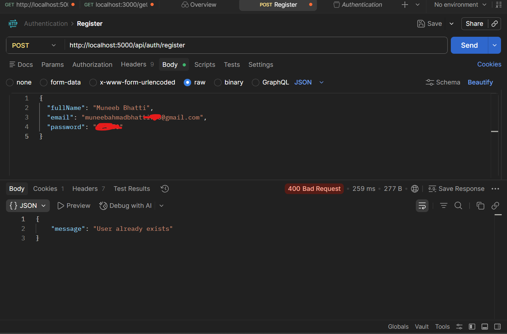
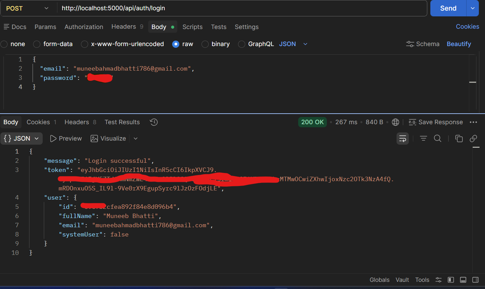
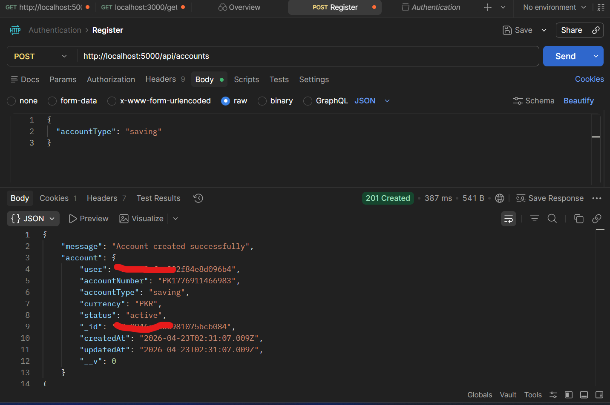
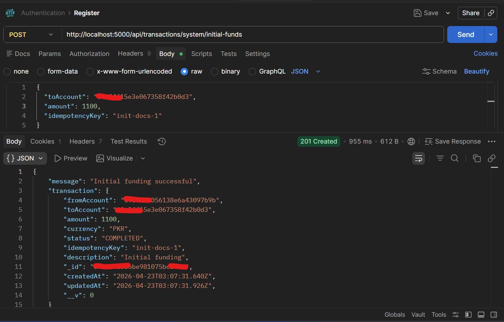
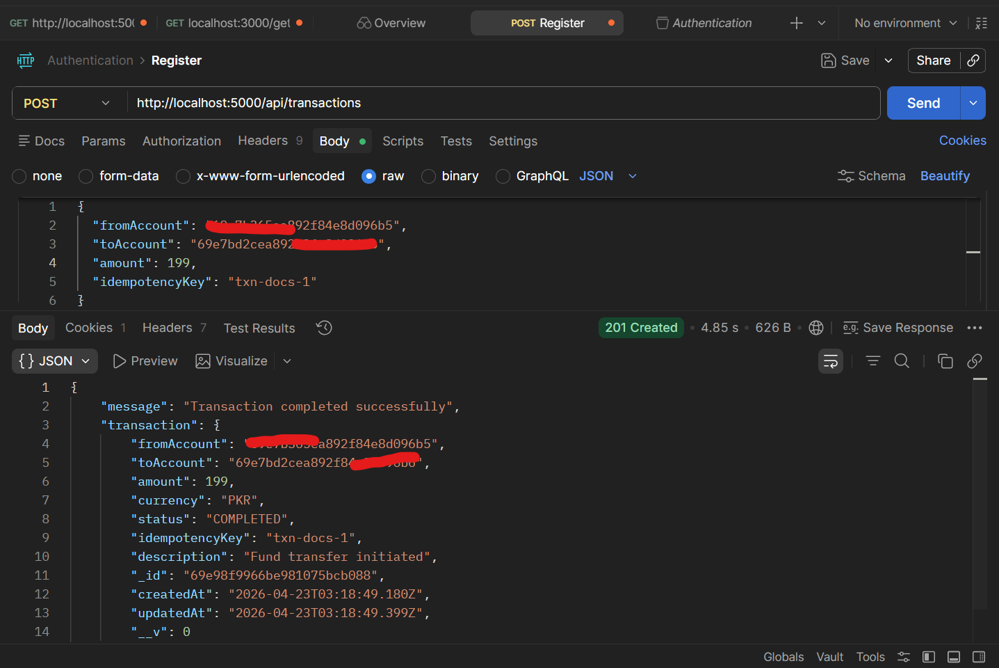
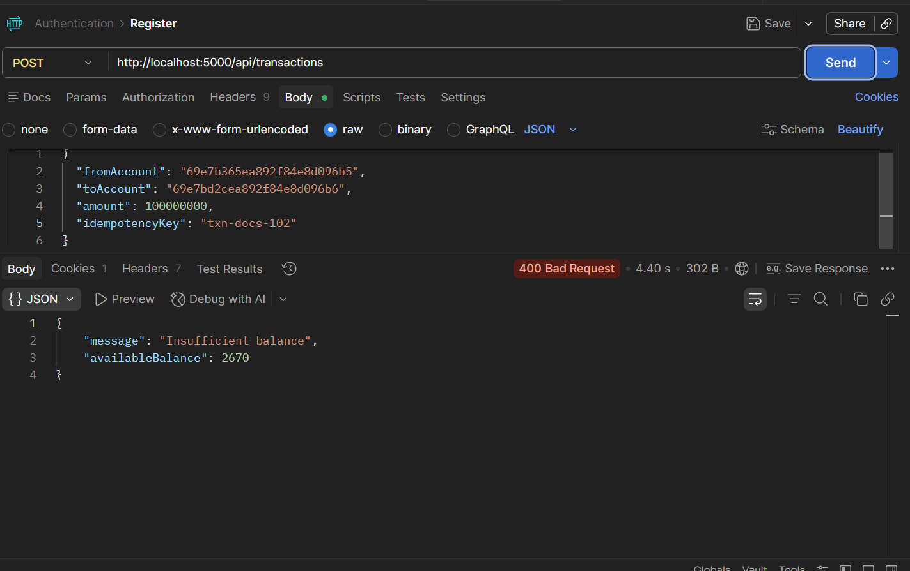
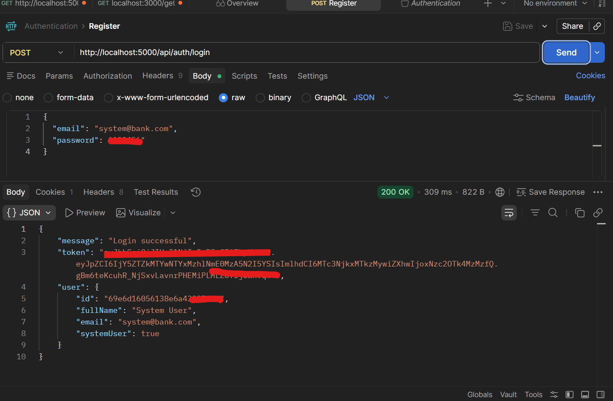

# 💳 Bank Transaction System (Backend)

A fully functional backend banking system built using **Node.js, Express, and MongoDB** that simulates real-world financial transactions using a **ledger-based accounting system**.

---

## 🚀 Features

### 🔐 Authentication & Security

- JWT-based authentication
- Cookie-based session handling
- Token blacklisting on logout
- Protected routes using middleware

### 🏦 Account Management

- Multiple bank accounts per user
- Unique account IDs and account numbers
- Account status handling (active/inactive)
- Ownership-based access control

### 💰 Ledger-Based Accounting System

- Uses **DEBIT/CREDIT entries** instead of storing balance directly
- Balance is calculated dynamically from ledger entries

#### Benefits:

- Prevents inconsistencies
- Provides full audit trail
- Matches real-world banking systems

### 🔁 Idempotent Transactions

- Prevents duplicate transactions using `idempotencyKey`
- Handles retries safely

### 🔄 Transaction System

- User-to-user money transfers
- Validation includes:
  - account ownership
  - account status
  - sufficient balance
- Transaction lifecycle:
  - PENDING → COMPLETED

### 🏦 System User (Bank Simulation)

- Special system user for initial funding
- Simulates real bank operations

### 📩 Email Notifications

- Integrated with Nodemailer (Gmail OAuth2)
- Emails sent for:
  - User registration
  - Transaction success
  - Transaction failure

### 🧠 MongoDB Transactions (Atomicity)

- Implemented **session-based transactions**
- Ensures:
  - all operations succeed OR none
  - automatic rollback on failure

---

## 🧠 How It Works

### Transaction Flow:

1. Validate request
2. Check idempotency key
3. Verify account ownership
4. Check account status
5. Check sufficient balance
6. Start MongoDB session
7. Create transaction (PENDING)
8. Create DEBIT entry
9. Create CREDIT entry
10. Mark transaction COMPLETED
11. Commit transaction
12. Send email notification

---

## 🛠️ Tech Stack

- Node.js
- Express.js
- MongoDB
- Mongoose
- JWT (Authentication)
- Nodemailer
- Cookie-parser

---

## 📁 Project Structure

src/
│
├── config/ # Database connection
├── controllers/ # Business logic
├── middleware/ # Auth middleware
├── models/ # MongoDB schemas
├── routes/ # API routes
├── services/ # Email service
├── utils/ # Helper functions
│
server.js # Entry point

---

## ⚙️ Installation

```bash
git clone https://github.com/muneeb123469/bank-transaction-system.git
cd bank-transaction-system
npm install
```

⚙️ Environment Variables

Create a .env file:
PORT=5000
MONGO_URI=your_mongodb_connection_string
JWT_SECRET=your_jwt_secret
EMAIL_USER=your_email@gmail.com
CLIENT_ID=your_client_id
CLIENT_SECRET=your_client_secret
REFRESH_TOKEN=your_refresh_token

▶️ Run the Project
npm run dev

🔌 API Endpoints
Auth
POST /api/auth/register
POST /api/auth/login
POST /api/auth/logout
Accounts
POST /api/accounts
GET /api/accounts
GET /api/accounts/:id/balance
Transactions
POST /api/transactions
POST /api/transactions/system/initial-funds

📊 Example Workflow
Register user
Login
Create account
Fund account (system user)
Transfer money
Check balance
Receive email notification

🔒 Security Features
JWT authentication
Cookie-based sessions
Token blacklist
Ownership validation
Input validation
Idempotency protection

📈 Future Improvements
MongoDB multi-document transactions with retry logic
Transaction history API
Admin dashboard
Rate limiting
Swagger API docs
React frontend

👨‍💻 Author
Muneeb Bhatti
Backend Developer (MERN Stack)

⭐ Final Note

This project demonstrates:
Real-world backend architecture
Financial transaction handling
Secure API development
Scalable system design

## 📸 API Testing Screenshots

### 📝 Register API



---

### 🔐 Login API



---

### 🏦 Create Account



---

### 💰 Initial Funding (System User)



---

### 💸 Transaction Success



---

### ❌ Transaction Failure



---

### 🏦 System User Login (Bank Simulation)


